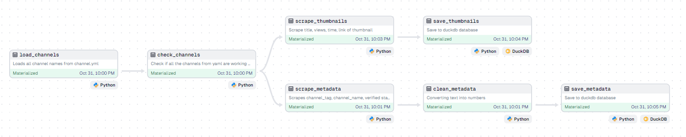
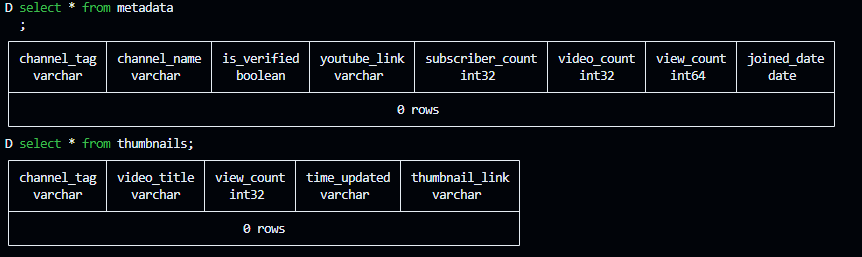
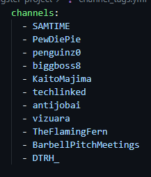
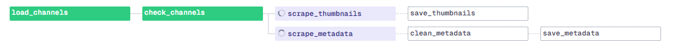
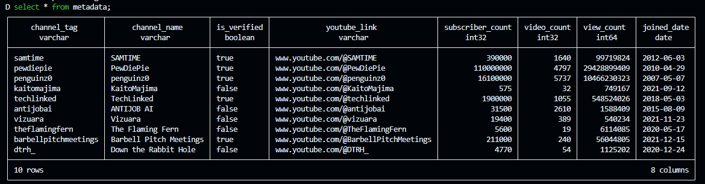
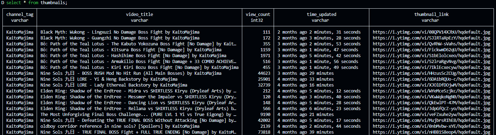
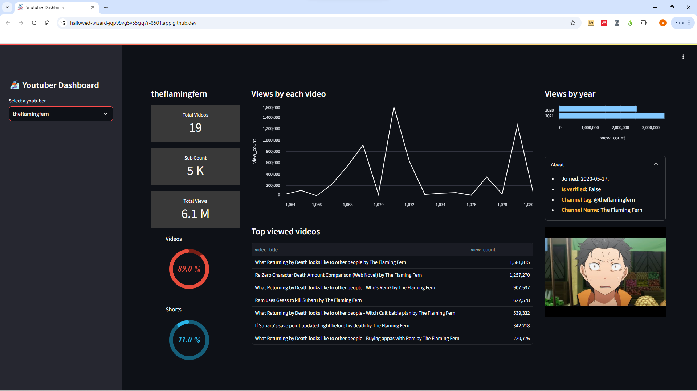
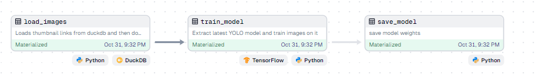

# YouTube Channel Analysis App [link](https://kolluri-youtube-dashboard.streamlit.app/)
## Overview

This project aims to analyze YouTube channels by scraping data using automated tools. The application is designed to scrape relevant data from YouTube, store it in DuckDB, and provide an interactive dashboard using Streamlit. While the primary goal was to analyze channel metrics, the project originally aimed to examine the correlation between YouTube thumbnails and views, which was ultimately outside the project scope.

## Technologies Used

- **System Design**: The application follows a modular architecture to ensure scalability and maintainability.
- **Dagster**: Utilized for orchestrating the data pipelines, allowing for efficient task scheduling and monitoring.
- **Python**: The primary programming language for building the application, including data scraping, processing, and dashboard development.
- **DuckDB**: Chosen as the analytical database to store and query the scraped data efficiently.
- **Data Modeling**: Employed to create a structured representation of the data to facilitate analysis.
- **Web Scraping**: Automated the process of gathering data from YouTube channels, including metadata and performance metrics.
- **ELT (Extract, Load, Transform)**: Implemented the ELT methodology to streamline data ingestion and transformation processes.
- **DBT (Data Build Tool)**: Used for transforming data within DuckDB, allowing for cleaner and more manageable SQL code.
- **Filesystem**: Managed data storage and retrieval processes through the filesystem for temporary and permanent data needs.
- **Data Deduplication**: Implemented strategies to identify and remove duplicate records from the dataset.
- **Star Schema**: Designed a star schema to optimize the data for analytical queries.
- **Schema Design**: Created a well-defined schema to ensure data integrity and efficient querying.
- **Resource Groups**: Established two resource groups—one for web scraping and another for machine learning model training.

### Web Scraper pipeline


### Table schemas


### Input file


### Running job


### Populating tables



### Dashboard using streamlit



## Challenges Faced

Throughout the development of this application, several challenges arose, including:

- **Data Quality**: Ensuring the accuracy and reliability of the scraped data was a significant challenge.
- **Data Duplication**: Developing effective methods for identifying and eliminating duplicate entries in the dataset.
- **Data Modeling**: Crafting an appropriate data model to support the analytical needs of the project.
- **Decision to Download Images**: Contemplated whether to include thumbnail images in the dataset, balancing storage costs with potential analysis benefits.
- **Workaround with Unloaded YouTube Chunks**: Encountered issues with accessing and loading certain chunks of data from YouTube, requiring creative solutions.


## To run dashboard
Install requirements
```bash
streamlit run app.py
```

## To run dagster
Go to file location
```bash
cd my-dagster-project
```
Run dagster
```bash
dagster dev
```


## Future Work
Future improvements could include:

Analyzing the correlation between YouTube thumbnails and view counts.
Implementing machine learning models to predict channel performance based on various metrics.
Enhancing the user interface of the dashboard for a better user experience.


